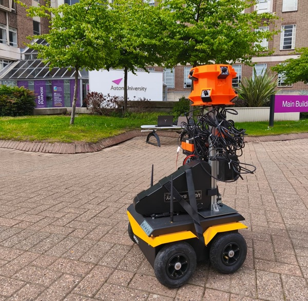

# Jackal Clearpath ROS 2 Workspace

Custom ROS 2 Humble workspace for a Clearpath Jackal mobile robot with SICK 2D LiDAR, SLAM Toolbox mapping, Nav2 localization, Nav2 autonomous navigation, and mission-level recording orchestration.

This repository documents and stores the configuration, launch files, scripts, maps, and recording pipeline components used to rebuild and operate the Jackal robot platform for mobile robotic data acquisition.

The system supports three main operating modes:

1. **Mapping** with SLAM Toolbox.
2. **Localization and autonomous navigation** with AMCL and Nav2.
3. **Synchronized data collection** using ROS bag recording and an external Jetson/camera recording pipeline.

A small public sample of the collected dataset, videos, and sensor data is available here:

**Sample dataset, video, and sensor data:**  
https://drive.google.com/drive/folders/1SuZDrliUXXNWbA5bpu4QSsQ0KeXi8SNo?usp=drive_link




---

## 1. Project Summary

This project configures a Clearpath Jackal robot as a mobile data acquisition and navigation platform. The robot runs ROS 2 Humble on Ubuntu 22.04 and uses a SICK 2D LiDAR for mapping, localization, and navigation.

The workspace includes:

- SLAM Toolbox launch and configuration for live map generation.
- Nav2 localization using AMCL and map server.
- Nav2 navigation using a saved occupancy grid map.
- Custom launch files for namespaced Jackal operation.
- Mission orchestration scripts for autonomous recording.
- Manual/teleop recording scripts for recording while driving the robot by joystick or keyboard trigger.
- ROS bag recording support for all topics.
- SSH-based triggering of an external Jetson recording system.
- Network and sensor configuration files.
- Saved map files.
- Camera/DeepStream-style pipeline scripts for the external recording system.

The overall goal is not only to make the robot navigate, but to create a repeatable mobile platform that can collect robot, LiDAR, navigation, camera, and sensor data in a structured way.

---

## 2. Hardware and Software Platform

| Component | Configuration |
|---|---|
| Robot platform | Clearpath Jackal |
| Operating system | Ubuntu 22.04 LTS |
| ROS distribution | ROS 2 Humble |
| Main ROS workspace | `/home/administrator/jackal_clearpath_ws/ros_ws` |
| Main custom package | `jackal_custom_config` |
| LiDAR | SICK TIM 2D LiDAR |
| LiDAR frame | `lidar2d_0_laser` |
| Robot namespace | `j100_0796` |
| Base frame | `base_link` |
| Odometry frame | `odom` |
| Map frame | `map` |
| ROS bag output | `/home/administrator/jackal_bags` |
| External recording system | Jetson-based camera/recording computer |
| Jetson IP used by orchestration | `192.168.5.1` |

---

## 3. Repository Structure

The repository is organised around robot configuration, ROS workspace files, map files, and external recording pipeline scripts.

```text
jackal_clearpath/
├── config/
│   ├── netplan/
│   ├── robot.yaml
│   └── sick_tim.yaml
│
├── maps/
│   ├── *.yaml
│   └── *.pgm
│
├── pipeline_scripts/
│   ├── settings/
│   ├── 2usb_n_2rtsp_to_file.py
│   ├── 2usb_n_2rtsp_to_rtsp.py
│   ├── 2usb_n_6rtsp_to_file.py
│   ├── 2usb_n_6rtsp_to_rtsp.py
│   ├── 2usb_to_2rtsp.py
│   └── gpu_access_check.sh
│
├── ros_ws/
│   └── src/
│       └── jackal_custom_config/
│           ├── CMakeLists.txt
│           ├── package.xml
│           ├── config/
│           │   ├── active/
│           │   └── legacy/
│           ├── launch/
│           │   ├── sensors/
│           │   ├── legacy/
│           │   ├── goal_mission_orchestrator.launch.py
│           │   ├── nav2_localization_jackal.launch.py
│           │   ├── nav2_navigation_jackal.launch.py
│           │   └── slam_toolbox_jackal.launch.py
│           └── scripts/
│               ├── startup/
│               ├── goal_mission_orchestrator.py
│               ├── goal_mission_orchestrator_test.py
│               ├── keyboard_record_orchestrator.py
│               ├── manual_record_orchestrator.py
│               └── simple_record_trigger.py
│
├── project_manifest.yaml
└── .gitignore
```

---

## 4. Main ROS Package

The main package is:

```text
ros_ws/src/jackal_custom_config
```

This package contains the robot-specific configuration files, launch files, and Python scripts used to run the custom Jackal stack.

### 4.1 Package Purpose

`jackal_custom_config` provides:

- Jackal-specific SLAM Toolbox bringup.
- Jackal-specific Nav2 localization bringup.
- Jackal-specific Nav2 navigation bringup.
- Namespace and topic remapping for `j100_0796`.
- Mission orchestration between RViz goals, Nav2, ROS bag, and external camera recording.
- Manual recording triggers for teleoperation-based data collection.

### 4.2 Installed Scripts

The package installs the main Python orchestration scripts into the ROS 2 install space. After building and sourcing the workspace, they can be run using:

```bash
ros2 run jackal_custom_config <script_name>
```

Examples:

```bash
ros2 run jackal_custom_config goal_mission_orchestrator.py
ros2 run jackal_custom_config keyboard_record_orchestrator.py
ros2 run jackal_custom_config simple_record_trigger.py
```

> Note: the repository currently contains `manual_record_orchestrator.py` for manual/teleop recording. If this script is intended to be run through `ros2 run`, ensure it is included in `CMakeLists.txt` under the `install(PROGRAMS ...)` section.

---

## 5. ROS Architecture

### 5.1 Namespace

The robot uses the namespace:

```text
/j100_0796
```

Most robot topics are therefore namespaced. This is important when using RViz, Nav2, AMCL, map server, rosbag, and external monitoring tools.

### 5.2 Main Frames

The transform chain is:

```text
map -> odom -> base_link -> lidar2d_0_laser
```

| Frame | Purpose |
|---|---|
| `map` | Global map frame used by SLAM, AMCL, and Nav2 |
| `odom` | Local odometry frame |
| `base_link` | Robot base frame |
| `lidar2d_0_laser` | SICK 2D LiDAR frame |

### 5.3 Main Topics and Actions

| Interface | Topic / Action |
|---|---|
| LiDAR scan | `/j100_0796/sensors/lidar2d_0/scan` |
| TF | `/j100_0796/tf` |
| Static TF | `/j100_0796/tf_static` |
| Velocity command | `/j100_0796/cmd_vel` |
| AMCL pose | `/j100_0796/amcl_pose` |
| Mapping map topic | `/map` |
| Localization map topic | `/j100_0796/map` |
| RViz hijacked goal input | `/goal_pose_hijacked` |
| Goal released to Nav2/RViz topic | `/j100_0796/goal_pose` |
| Nav2 action | `/j100_0796/navigate_to_pose` |
| Nav2 action status | `/j100_0796/navigate_to_pose/_action/status` |

---

## 6. System Operating Modes

The project supports several robot operating modes.

### 6.1 Mapping Mode

Mapping mode is used to create an occupancy grid map of the environment using SLAM Toolbox and the SICK 2D LiDAR.

Launch file:

```text
slam_toolbox_jackal.launch.py
```

Typical command:

```bash
source ~/.bashrc
ros2 launch jackal_custom_config slam_toolbox_jackal.launch.py
```

Expected output:

- Live map topic.
- TF between `map`, `odom`, `base_link`, and LiDAR frame.
- Saved `.yaml` and `.pgm` map files after map export.

### 6.2 Localization Mode

Localization mode loads a saved map and localizes the robot using AMCL.

Launch file:

```text
nav2_localization_jackal.launch.py
```

Typical command:

```bash
source ~/.bashrc
ros2 launch jackal_custom_config nav2_localization_jackal.launch.py
```

To override the map at launch:

```bash
ros2 launch jackal_custom_config nav2_localization_jackal.launch.py \
  map:=/home/administrator/jackal_clearpath_ws/maps/map_306.yaml
```

### 6.3 Navigation Mode

Navigation mode runs the Nav2 stack for autonomous goal-based motion.

Launch file:

```text
nav2_navigation_jackal.launch.py
```

Typical command:

```bash
source ~/.bashrc
ros2 launch jackal_custom_config nav2_navigation_jackal.launch.py
```

The robot can then receive a 2D Goal Pose from RViz or from the custom mission orchestrator.

### 6.4 Autonomous Recording Mode

Autonomous recording mode connects goal-based navigation with external camera recording and ROS bag recording.

Launch files:

```text
nav2_navigation_jackal.launch.py
goal_mission_orchestrator.launch.py
```

Typical commands:

```bash
source ~/.bashrc

ros2 launch jackal_custom_config nav2_navigation_jackal.launch.py
ros2 launch jackal_custom_config goal_mission_orchestrator.launch.py
```

Workflow:

1. User sends a 2D goal pose from RViz.
2. RViz goal is remapped to `/goal_pose_hijacked`.
3. `goal_mission_orchestrator.py` receives the hijacked goal.
4. The orchestrator sends an SSH `START` command to the Jetson recording system.
5. The system waits 10 seconds for external recording startup.
6. ROS bag recording starts.
7. The goal is published to `/j100_0796/goal_pose`.
8. A Nav2 action goal is sent to `/j100_0796/navigate_to_pose`.
9. The orchestrator waits for Nav2 action completion.
10. ROS bag recording stops.
11. The orchestrator sends an SSH `STOP` command to the Jetson recording system.

This creates a synchronised recording sequence between robot navigation data and external camera data.

### 6.5 Manual / Teleop Recording Mode

Manual/teleop recording mode is used when the robot is driven manually, for example using a joystick, while data recording is started and stopped separately.

Current repository script:

```text
manual_record_orchestrator.py
```

Manifest name / conceptual mode:

```text
teleop_record_orchestrator.py
```

Typical workflow:

1. Start the teleop node.
2. Start the manual/teleop recording orchestrator.
3. Drive the robot manually.
4. Use the configured trigger to start recording.
5. Use the configured trigger to stop recording.

Example:

```bash
source ~/.bashrc

ros2 run teleop_twist_joy teleop_node
ros2 run jackal_custom_config manual_record_orchestrator.py
```

Important design point:

The recording orchestrator does **not** publish to `/cmd_vel`. The teleop node remains the only velocity command publisher. This prevents recording logic from interfering with robot motion control.

### 6.6 Keyboard Recording Mode

Keyboard recording mode is used when the robot is manually driven, but the recording is controlled by keyboard input.

Script:

```text
keyboard_record_orchestrator.py
```

Typical command:

```bash
source ~/.bashrc

ros2 run teleop_twist_joy teleop_node
ros2 run jackal_custom_config keyboard_record_orchestrator.py
```

Keyboard controls:

| Key | Function |
|---|---|
| `s` | Start recording |
| `x` | Stop recording |
| `q` | Quit keyboard orchestrator |

This mode is useful when joystick button mappings are unreliable or when recording needs to be controlled from a terminal.

---

## 7. Data Recording

### 7.1 ROS Bag Recording

The system records ROS topics using:

```bash
ros2 bag record -a --output <timestamped_folder>
```

The default output directory is:

```text
/home/administrator/jackal_bags
```

The naming format is:

```text
mission_YYYYMMDD_HHMMSS_<uuid>
```

This prevents old recordings from being overwritten.

### 7.2 Data Captured in ROS Bags

Since the recording mode uses `-a`, all currently available ROS topics are recorded. Depending on which nodes are running, this can include:

- LiDAR scan data.
- TF and static TF.
- Odometry.
- AMCL pose.
- Map data.
- Nav2 costmap topics.
- Goal topics.
- Action status topics.
- Robot state topics.
- Teleop-related topics.
- Other active sensor or diagnostic topics.

### 7.3 Copying ROS Bags from the Robot

Example transfer command:

```bash
scp -r administrator@<JACKAL_IP>:/home/administrator/jackal_bags/* ~/Desktop/
```

Replace `<JACKAL_IP>` with the IP address of the Jackal on the current network.

### 7.4 Sample Dataset

A small sample of dataset files, video files, and sensor data is stored externally because full robotic datasets and videos are usually too large for GitHub.

Sample data location:

```text
https://drive.google.com/drive/folders/1SuZDrliUXXNWbA5bpu4QSsQ0KeXi8SNo?usp=drive_link
```

This folder can be used to inspect representative outputs without downloading the full project dataset.

---

## 8. External Camera / Jetson Recording Pipeline

The robot can trigger an external Jetson-based recording system over SSH.

### 8.1 SSH Target

| Field | Value |
|---|---|
| Jetson IP | `192.168.5.1` |
| SSH protocol | Key-based SSH |
| Password prompt | Not expected during normal operation |

### 8.2 Current Orchestrator Commands

The autonomous mission orchestrator currently uses shell scripts on the Jetson side:

```python
self.start_cmd = 'bash /home/arp/start_recording.sh'
self.stop_cmd = 'bash /home/arp/stop_recording_and_transfer.sh'
```

These scripts are responsible for starting and stopping the external recording pipeline.

Earlier placeholder logic used simple trigger files such as:

```bash
touch ~/start.txt
touch ~/stop.txt
```

The final system should use real recording scripts on the Jetson.

### 8.3 Pipeline Scripts

The repository includes camera pipeline scripts under:

```text
pipeline_scripts/
```

Examples include:

```text
2usb_n_2rtsp_to_file.py
2usb_n_2rtsp_to_rtsp.py
2usb_n_6rtsp_to_file.py
2usb_n_6rtsp_to_rtsp.py
2usb_to_2rtsp.py
gpu_access_check.sh
```

These scripts support USB and RTSP-style video capture/streaming workflows. They are separated from the ROS package because they belong to the external recording/camera pipeline rather than the Jackal ROS 2 control stack.

---

## 9. Map Management

Map files are stored under:

```text
/home/administrator/jackal_clearpath_ws/maps
```

The active map currently documented in the project manifest is:

```text
/home/administrator/jackal_clearpath_ws/maps/map_2.yaml
/home/administrator/jackal_clearpath_ws/maps/map_2.pgm
```

### 9.1 Runtime Map Switching

A map can be switched at runtime using the Nav2 map server load map service:

```bash
ros2 service call /j100_0796/map_server/load_map nav2_msgs/srv/LoadMap \
  "{map_url: /home/administrator/jackal_clearpath_ws/maps/map_306.yaml}"
```

### 9.2 Launch-Time Map Override

A different map can also be loaded at launch:

```bash
ros2 launch jackal_custom_config nav2_localization_jackal.launch.py \
  map:=/home/administrator/jackal_clearpath_ws/maps/map_306.yaml
```

Map switching should be done on the robot side, not from the laptop, because the map server runs on the robot and expects file paths that exist on the robot filesystem.

---

## 10. RViz Usage

RViz can be run from a laptop or from the robot, but topic remapping is important because the robot uses the `j100_0796` namespace.

Example RViz command:

```bash
rviz2 --ros-args \
  -r /tf:=/j100_0796/tf \
  -r /tf_static:=/j100_0796/tf_static \
  -r /initialpose:=/j100_0796/initialpose \
  -r /goal_pose:=/j100_0796/goal_pose \
  -r /robot_description:=/j100_0796/robot_description
```

Important notes:

- RViz does not need local map files.
- The map is streamed from the robot through ROS topics.
- If using autonomous recording mode, the RViz 2D Goal Pose should be remapped or configured to publish to:

```text
/goal_pose_hijacked
```

The orchestrator then releases the real goal to:

```text
/j100_0796/goal_pose
```

---

## 11. Installation and Build

### 11.1 Clone the Repository

On the Jackal:

```bash
cd /home/administrator
git clone https://github.com/M-Foroutan-M/jackal_clearpath.git jackal_clearpath_ws
```

If the repository is already cloned, update it with:

```bash
cd /home/administrator/jackal_clearpath_ws
git pull
```

### 11.2 Build the ROS Workspace

```bash
cd /home/administrator/jackal_clearpath_ws/ros_ws
colcon build --symlink-install
```

### 11.3 Source the Workspace

```bash
source /opt/ros/humble/setup.bash
source /home/administrator/jackal_clearpath_ws/ros_ws/install/setup.bash
```

A typical `~/.bashrc` setup is:

```bash
source /etc/clearpath/setup.bash
source ~/jackal_clearpath_ws/ros_ws/install/setup.bash
export CP_CUSTOM_LAUNCH=$HOME/jackal_clearpath_ws/ros_ws/src/jackal_custom_config/launch/sensors/sick_tim_custom.launch.py
```

After editing `~/.bashrc`, reload it:

```bash
source ~/.bashrc
```

---

## 12. Dependencies

This project assumes a working ROS 2 Humble installation and a Clearpath Jackal base setup.

Main ROS components used by this project include:

- ROS 2 Humble.
- Clearpath Jackal ROS 2 stack.
- `slam_toolbox`.
- `nav2_bringup`.
- `nav2_msgs`.
- `geometry_msgs`.
- `action_msgs`.
- `rclpy`.
- `rosbag2`.
- `teleop_twist_joy`.
- SICK LiDAR driver, typically `sick_scan_xd`.

Install common ROS dependencies:

```bash
sudo apt update

sudo apt install -y \
  ros-humble-slam-toolbox \
  ros-humble-navigation2 \
  ros-humble-nav2-bringup \
  ros-humble-teleop-twist-joy \
  ros-humble-rosbag2-storage-default-plugins
```

If the SICK driver is not installed, install or build the appropriate ROS 2 SICK driver for the LiDAR model used on the robot.

---

## 13. Network Configuration

The project includes network-related configuration under:

```text
config/netplan/
```

The wider project uses static networking to make robot, LiDAR, laptop, and Jetson communication predictable.

Known network roles:

| Network / Device | Purpose |
|---|---|
| Jackal internal network | Robot and sensor communication |
| SICK LiDAR | Connected on the robot/sensor network |
| Jetson / camera system | External recording system |
| Laptop | Remote RViz, SSH, file transfer, monitoring |

The orchestration pipeline expects the external Jetson recording system to be reachable at:

```text
192.168.5.1
```

Before running mission recording, confirm that SSH works without a password prompt:

```bash
ssh arp@192.168.5.1
```

If this asks for a password, configure SSH keys before using the autonomous recording pipeline.

---

## 14. Typical Bringup Workflows

### 14.1 Mapping Workflow

```bash
source ~/.bashrc
ros2 launch jackal_custom_config slam_toolbox_jackal.launch.py
```

Check LiDAR:

```bash
ros2 topic hz /j100_0796/sensors/lidar2d_0/scan
ros2 topic echo /j100_0796/sensors/lidar2d_0/scan --once
```

Check TF:

```bash
ros2 topic echo /j100_0796/tf --once
ros2 run tf2_tools view_frames
```

### 14.2 Localization Workflow

```bash
source ~/.bashrc
ros2 launch jackal_custom_config nav2_localization_jackal.launch.py
```

Check map:

```bash
ros2 topic echo /j100_0796/map --once
```

Check AMCL pose:

```bash
ros2 topic echo /j100_0796/amcl_pose --once
```

### 14.3 Navigation Workflow

```bash
source ~/.bashrc
ros2 launch jackal_custom_config nav2_navigation_jackal.launch.py
```

Check Nav2 action:

```bash
ros2 action list | grep navigate_to_pose
```

Check velocity command topic:

```bash
ros2 topic info /j100_0796/cmd_vel
```

### 14.4 Autonomous Mission Recording Workflow

Terminal 1:

```bash
source ~/.bashrc
ros2 launch jackal_custom_config nav2_navigation_jackal.launch.py
```

Terminal 2:

```bash
source ~/.bashrc
ros2 launch jackal_custom_config goal_mission_orchestrator.launch.py
```

Terminal 3, optional verification:

```bash
ros2 topic echo /j100_0796/goal_pose
ros2 action list | grep navigate_to_pose
```

Then send a goal from RViz to `/goal_pose_hijacked`.

### 14.5 Keyboard Recording Workflow

Terminal 1:

```bash
source ~/.bashrc
ros2 run teleop_twist_joy teleop_node
```

Terminal 2:

```bash
source ~/.bashrc
ros2 run jackal_custom_config keyboard_record_orchestrator.py
```

Controls:

```text
s = start recording
x = stop recording
q = quit
```

---

## 15. Verification Matrix

### 15.1 Autonomous Recording Success Criteria

| Check | Expected Result |
|---|---|
| Hijacked goal received | Orchestrator logs goal position |
| SSH START sent | Jetson recording starts |
| Startup delay completed | Goal is released after delay |
| ROS bag started | New timestamped bag folder appears |
| Goal published | `/j100_0796/goal_pose` receives goal |
| Nav2 action active | `/j100_0796/navigate_to_pose` action runs |
| Mission completes | Nav2 action returns result |
| ROS bag stopped | Bag process closes cleanly |
| SSH STOP sent | Jetson recording stops/transfers data |

### 15.2 Manual / Teleop Recording Success Criteria

| Check | Expected Result |
|---|---|
| Teleop active | Robot moves using controller |
| Recording trigger works | ROS bag starts |
| Stop trigger works | ROS bag stops |
| Motion unaffected | Recording node does not publish `/cmd_vel` |
| Output saved | Timestamped ROS bag folder is created |

### 15.3 Keyboard Recording Success Criteria

| Check | Expected Result |
|---|---|
| `s` pressed | Recording starts |
| `x` pressed | Recording stops |
| `q` pressed | Script exits |
| Teleop still active | Robot can still be driven normally |
| Output saved | Timestamped ROS bag folder is created |

---

## 16. Troubleshooting

### 16.1 Package Not Found

If ROS cannot find `jackal_custom_config`:

```bash
cd /home/administrator/jackal_clearpath_ws/ros_ws
colcon build --symlink-install
source install/setup.bash
ros2 pkg list | grep jackal_custom_config
```

### 16.2 Script Not Found with `ros2 run`

Check whether the script is installed in `CMakeLists.txt`.

For example, ensure the script appears under:

```cmake
install(
  PROGRAMS
  scripts/keyboard_record_orchestrator.py
  scripts/goal_mission_orchestrator.py
  scripts/goal_mission_orchestrator_test.py
  scripts/simple_record_trigger.py
  DESTINATION lib/${PROJECT_NAME}
)
```

If adding another script, rebuild:

```bash
colcon build --symlink-install
source install/setup.bash
```

### 16.3 No LiDAR Data

Check the LiDAR topic:

```bash
ros2 topic list | grep scan
ros2 topic hz /j100_0796/sensors/lidar2d_0/scan
```

Check network connectivity to the LiDAR if the topic is missing.

### 16.4 No Map in RViz

Check the map topic:

```bash
ros2 topic list | grep map
ros2 topic echo /j100_0796/map --once
```

Make sure RViz is using the correct fixed frame:

```text
map
```

### 16.5 TF Problems

Check TF topics:

```bash
ros2 topic echo /j100_0796/tf --once
ros2 topic echo /j100_0796/tf_static --once
```

Generate a TF tree:

```bash
ros2 run tf2_tools view_frames
```

Expected chain:

```text
map -> odom -> base_link -> lidar2d_0_laser
```

### 16.6 Nav2 Goal Does Not Move Robot

Check:

```bash
ros2 action list | grep navigate_to_pose
ros2 topic info /j100_0796/cmd_vel
ros2 topic echo /j100_0796/goal_pose
```

Also check:

- AMCL has an initial pose.
- The map is loaded.
- The robot footprint/costmap is valid.
- The goal is reachable.
- The lifecycle nodes are active.

### 16.7 SSH Recording Trigger Fails

Test SSH manually:

```bash
ssh arp@192.168.5.1
```

Test the remote start script:

```bash
ssh arp@192.168.5.1 'bash /home/arp/start_recording.sh'
```

Test the remote stop script:

```bash
ssh arp@192.168.5.1 'bash /home/arp/stop_recording_and_transfer.sh'
```

If SSH asks for a password, configure key-based SSH authentication.

### 16.8 ROS Bag Not Saved

Check output folder:

```bash
ls -lah /home/administrator/jackal_bags
```

Check available disk space:

```bash
df -h
```

Check whether another rosbag process is already running:

```bash
pgrep -af "ros2 bag record"
```

---

## 17. Safety Notes

This repository is intended for real robot operation. Before running navigation or recording missions:

- Confirm emergency stop access.
- Confirm the robot is in a safe test area.
- Confirm LiDAR data is active.
- Confirm TF is valid.
- Confirm the map is correct for the environment.
- Confirm Nav2 costmaps are displaying obstacles.
- Confirm the robot can be stopped manually.
- Do not run autonomous navigation near people, fragile objects, stairs, roads, or unsafe obstacles without supervision.

---

## 18. Known Implementation Notes

- Orchestrator nodes do **not** publish velocity commands.
- Navigation completion is detected using the Nav2 action result/status, not only pose heuristics.
- ROS bag folders are timestamped to avoid overwriting previous recordings.
- The external recording system is triggered over SSH.
- RViz can run remotely, but topic remapping is required.
- Map switching should be performed on the robot because map paths are robot-local.
- Manual/teleop recording is decoupled from robot driving.
- Keyboard recording is useful when joystick recording buttons are inconvenient or unreliable.
- Large datasets and videos should be stored outside GitHub; the sample dataset is provided through Google Drive.

---


## 20. Citation / Project Reference

If this repository is referenced in a dissertation, report, or technical document, it can be described as:

> A custom ROS 2 Humble workspace for a Clearpath Jackal robot, integrating SICK 2D LiDAR-based SLAM, AMCL localization, Nav2 autonomous navigation, and mission-level data recording orchestration with an external Jetson-based camera pipeline.

Repository:

```text
https://github.com/M-Foroutan-M/jackal_clearpath
```

Sample dataset:

```text
https://drive.google.com/drive/folders/1SuZDrliUXXNWbA5bpu4QSsQ0KeXi8SNo?usp=drive_link
```

---

## 21. Author

Developed by Mohammad Foroutan.

Repository owner:

```text
M-Foroutan-M
```
